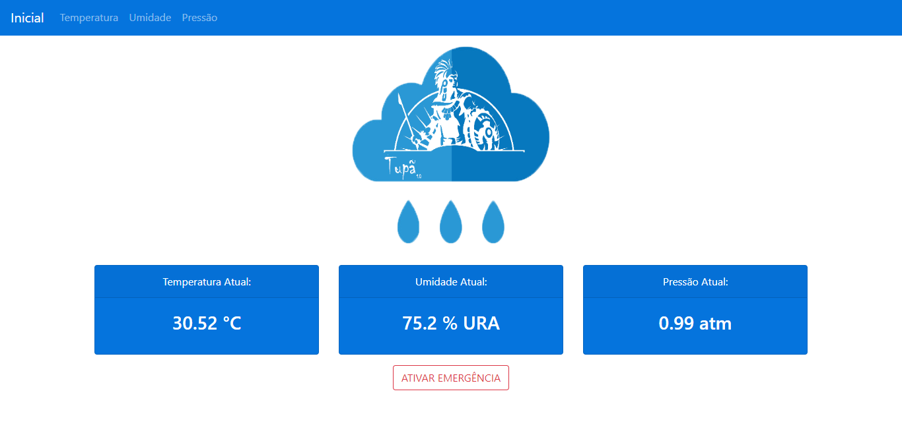
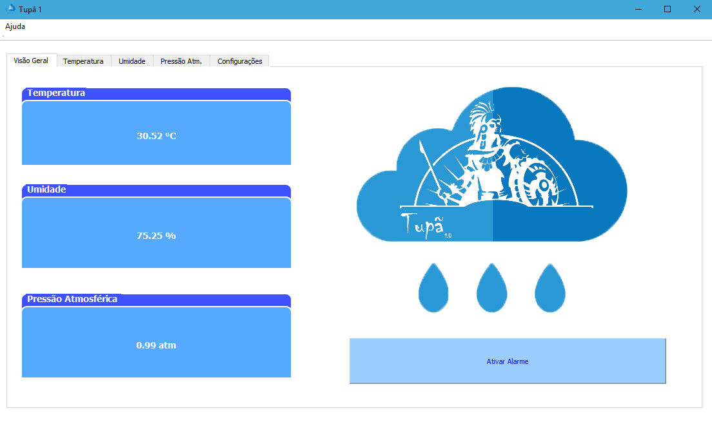
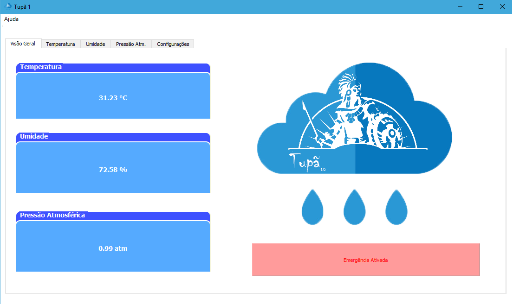
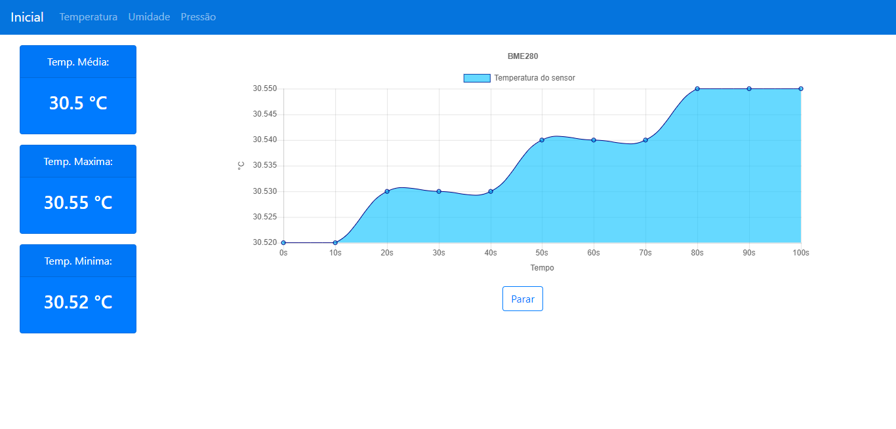
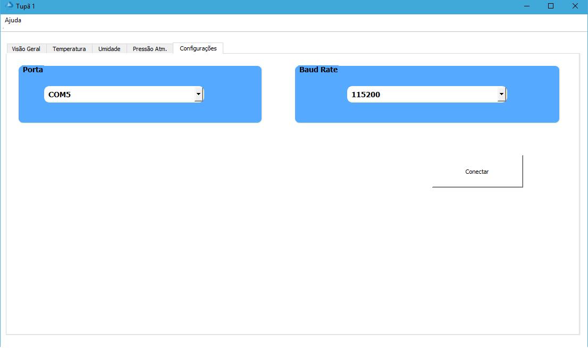

# Tupa1.0 - Estação Meteorológica 

  

## Guia Rápido 
- [Introdução](#introdução)
- [Funcionalidades](#funcionalidades)
- [Materiais](#materiais)
- [Bibliotecas](#bibliotecas)
- [Comunicação](#comunicação)
- [Site](#site)
- [QT](#qt)
- [Instalação](#instalação)

## Introdução 
Sobreviver sempre foi a maior das preocupações dos seres vivos. Os humanos não fogem de tal regra. Muitas técnicas e tecnologias foram criadas e desenvolvidas com esse intuito, sendo umas das mais fundamentais a de conseguir analisar o clima e as estações.
Com o decorrer do tempo essa ciência ficou conhecida como Meteorologia (Estudo dos Céus), seus primeiros relatos denotam de mais de dois milênios atrás, sendo objeto de estudos até hoje dado a sua fundamental importância em inúmeros aspectos.
Na agricultura, devido à uma boa colheita ser intrinsecamente ligada a uma irrigação adequada e possivelmente evitando inundação da colheita. Na produção de Energia, visto que algumas fontes dependem diretamente de fenômenos naturais: Hidroelétricas, Solar, Eólica. Também atuando como forma de salvar vidas, visto que várias catástrofes naturais podem ser evitadas com aquisição e interpretação adequada de dados meteorológicos.
  Tendo conhecimento dos fatores supracitados é notório a importância de tal campo da ciência ainda mais quando trazemos para a nossa realidade, Brasil. Um país majoritariamente agropecuário, alimentado eletricamente quase que em sua totalidade por hidroelétricas e que por se encontrar próximo a linha do equador e ser de clima tropical em sua maior parte do território apresenta alta taxa de pluviosidade, pluviosidade essa que muitas vezes causa desastres, vide Brumadinho (2019) e Mariana (2015), desastres esses que poderiam ser evitados com previsões meteorológicas.

## Funcionalidades 
Com tudo isso em mente, foi proposto o desenvolvimento de uma estação meteorológica de baixo custo que fosse capaz de medir: Temperatura, Umidade relativa do ar e Pressão Atmosférica e disponibilizar tais informações via web (Site) como disposto na figura abaixo

.. Assim como também localmente (Qt) apresentado na figura a seguir.

.  Bem como adicionalmente apresentar uma forma de alarmar as proximidades caso haja a necessidade, sendo essa tarefa realizada mediante o acionamento de um botão em ambas as plataformas, visando maior segurança e agilidade na resposta.

 

## Materiais

 - ##### BME280
    + ###### [Instruções do BME280](https://www.embeddedadventures.com/datasheets/BME280.pdf)

 BME – É possível afirmar que esse sensor é o coração do projeto em questão, pois é dele que os dados de temperatura, umidade relativa do ar e pressão atmosférica são oriundos. 
 - ##### NODEMCU ESP32
    + ###### [Instruções do ESP32](https://www.espressif.com/sites/default/files/documentation/esp32_datasheet_en.pdf)
    
 NodemcuEsp32 – Como uma das finalidades do projeto era dispor as informações online, se fazia necessário um módulo wifi, por isso foi utilizado esse microcontrolador no projeto, visto que ele já disponibilizava tudo isso acoplado. Vale ressaltar que esse Microcontrolador difere do que foi inicialmente proposto de ser usado pelo professor o que resultou em algumas mudanças nas bibliotecas e métodos utilizados ao longo do projeto (Será exemplificado e melhor explicado futuramente). 
 - ##### Buzzer
    + ###### [Instruções do Buzzer](http://www.farnell.com/datasheets/2171929.pdf)
    
 Buzzer – Foi utilizado um Buzzer no projeto como instrumento de simulação de uma sirene ou algo do gênero, no caso de se fazer necessário um alarme de emergência mediante alguma anomalia ou respectiva necessidade.  
## Bibliotecas

  - ##### WiFi.h
    + ###### [Dados da Biblioteca WiFi.h](https://github.com/espressif/arduino-esp32)
    
 Wifi.h, Essa biblioteca foi utilizada pela ESP32 e teve sua principal função auxiliar na conexão do microcontrolador com uma rede disponível para só assim enviar os dados para um servidor web. 

Principais métodos utilizados: ” wifi.status() “  indica o status da conexão.
                               “ wifi.begin() “  inicializa a conexão uma rede.
  - ##### BME280I2C.h
    + ###### [Dados da Biblioteca BME280I2C.h](https://github.com/finitespace/BME280)
    
BME280I2C.h Biblioteca própria do sensor usada principalmente para facilitar a aquisição e tratamentos de dados fornecidos pelo mesmo.

Principais métodos utilizados: “bme.read()” realiza a leitura de dados do sensor.
                               “bme.begin()” inicializa o sensor.
                               “bme.chipmodel()” identifica qual o modelo em uso.

  - ##### HTTPClient.h   
    + ###### [Dados da Biblioteca HTTPClient.h](https://github.com/espressif/arduino-esp32)
    
HTTPClient.h Biblioteca usada majoritariamente para lidar com envio e recebimento de dados para os endereços virtuais.
Principais métodos utilizados: “http.begin() “ identifica o endereço destino.
                               “http.header()” especifica o conteúdo do header.
                               “http.GET()” faz o pedido das informações
                               “http.POST()” envia as informações.
                               “http.getString()” flag / recebimento de dados.
                               “http.end()” encerra os processos.
 
## Comunicação
 - #### NODEMCU ESP 32 <-> SITE
   + ###### TRAFEGO DE DADOS ESP32 <-> SITE – O deslocamento de dados está sendo auxiliado pelas bibliotecas e métodos previamente citados e utilizando-se de JSON que nada mais é que um objeto formado pela concatenação de strings.
   + ###### SERVIDOR EM PYTHON – Para o recebimento dos dados foi desenvolvido um servidor em Python (Flask) para servir de Back-End, a plataforma utilizada para hospedar tal serviço foi a Heroku. 
   + ###### SITE EM JAVASCRIPT/HTML – O Front-End foi desenvolvido com HTML sendo a linguagem de descrição padrão e JavaScript como a linguagem de programação padrão. A interface gráfica ficou a cargo da CSS BOOTSTRAP, interface essa que é bem comum, simples e visualmente agradável, com algumas adições do uso de JSCharts para configuração dos gráficos expostos.  
 - #### NODEMCU ESP 32 <-> QT
   + ###### TRAFEGO DE DADOS ESP32 <-> QT – Essa relação de dados funciona de forma bem semelhante ao do Site, porém a forma de concatenação das strings se dar de forma diferente e em função do BaudRate, que é a velocidade estipulada de comunicação entre as duas plataformas.
  
## Site
O Site apresenta um layout bem intuitivo, na página inicial é demonstrado todos os dados adquiridos em tempo real, porém há também a opção de acionamento do botão de emergência e abas especificas para cada variável, relatando o valor máximo e mínimo colhido bem como uma média e seu respectivo gráfico para melhor entendimento, isso pode ser notado na figura abaixo.

 
## QT
Na plataforma Qt, o layout é bem semelhante, adicionando basicamente de uma aba especifica que identifica a velocidade de transmissão de dados e a porta serial que será utilizada para tal comunicação, ilustrado na figura seguinte.

.

## Instalação
Basta baixar a pasta release e executar o arquivo "Tupa1.exe".
